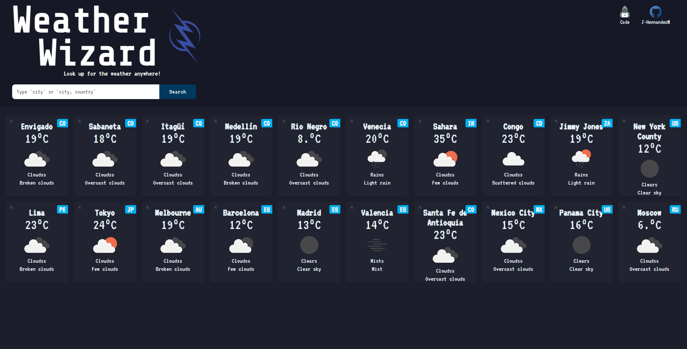

# WEATHER WIZARD

## Tabla de contenidos

- [Descripcion](#descripcion)
  - [El desafio](#el-desafio)
  - [Screenshot](#screenshot)
  - [Links](#links)
- [Mi proceso](#mi-proceso)
  - [Hecho con](#hecho-con)
  - [Lo aprendido](#lo-que-aprendi)
  - [En desarrollo](#en-desarrollo)
- [Autor](#autor)

## Descripcion

Web para consultar informacion basica del clima en diferentes ubicaciones a la vez[OpenWeather API](https://openweathermap.org), [Geocoding API](https://openweathermap.org) y [World countries](https://rapidapi.com/ikoaymen056/api/world-countries/).

## El desafio

El usuario deberia poder

- Ver el layout optimo dependiendo de su tamano de pantalla.
- Ver la interaccion cuando se coloca el mouse encima de los elementos.
- Ver la informacion climatologica de la ciudad consultada
- Poder buscar cualquier ciudad y obtener un resultado

## Screenshot

## Links

- Solucion: [GITHUB](https://github.com/J-HernandezM/weather-app/)
- Live site: [PAGES](https://j-hernandezm.github.io/weather-app/)

## Mi proceso

Me alegra bastante haber podido lograr hacer este reto, siento que implemente la logica de la mejor manera posible, consultando lo minimo posible fuentes externas, solamente para una guia de como hacer x cosa.

Gracias al reto anterior que realice no se me complico como tal la request y manejo de la response de la API, sino mas que todo el manejo de los inputs.

Tal vez lo que mas se me dificulto fue otorgarle a la API los datos como esta los requiere, con el codigo de paises y la latitud y longitud, pero una vez solucionado eso todo fue mejor.

## Hecho con

- Semantic HTML5 markup
- CSS custom properties
- Flexbox
- CSS Grid
- Mobile-first workflow
- Simple JavaScript
- API fetch

## Lo que aprendi

Me centre bastante en el tema de los colores de la pagina y quede bastante contendo con el resultado, aprendi a seguir guias de estilos y aplicarlas correctamente

## En desarrollo

Me gustaria en un futuro ampliar la informacion que brinda del clima de cada ciudad haciendo las tarjetas mas grandes, centrandose en una o pocas ciudades a la vez.

## Autor

- Website - [Portfolio en construccion](https://j-hernandezm.github.io)
- Github - [@J-HernandezM](https://github.com/J-HernandezM)
- Twitter - [@__HernandezM](https://www.twitter.com/__HernandezM)